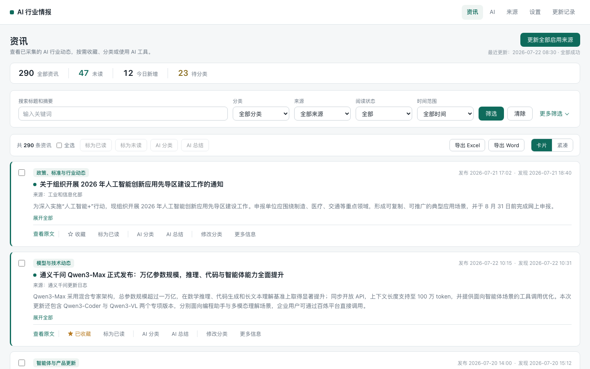
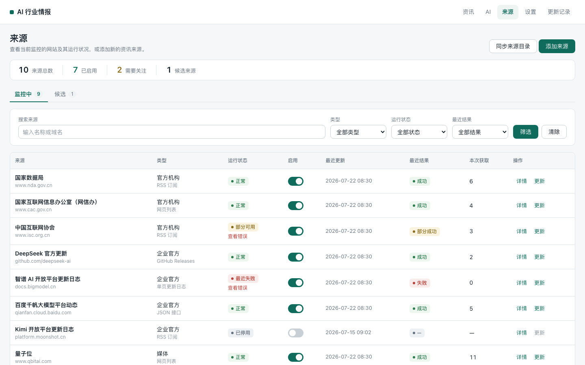
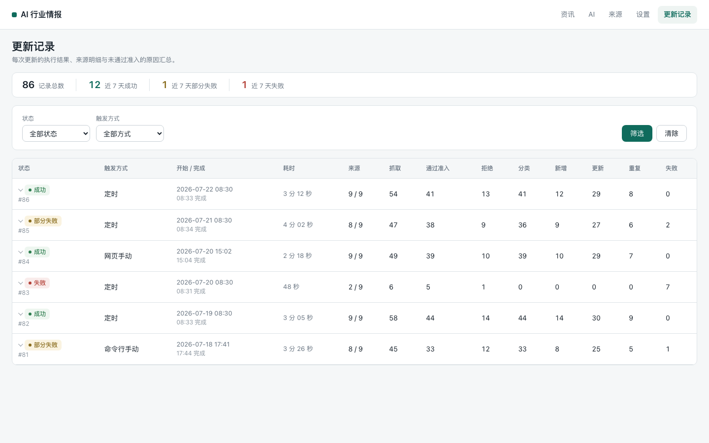

# AI Intelligence Monitor

一个本地优先的 AI 行业资讯监控工具：管理可信来源、执行采集与准入、按规则分类、人工复核，并在浏览器中筛选、标记、导出和审计更新记录。

默认使用纯规则模式，不需要 API Key，也不会自动调用外部 AI。DeepSeek/OpenAI-compatible 分类和总结是显式启用的可选能力。

## 功能概览

- 26 条 canonical 来源目录：18 条 active、8 条 candidate；
- RSS、HTML 列表、公开 JSON、GitHub Release 和单页更新日志采集器；
- 内容准入、去重、规则分类、人工分类、可信状态和审核状态；
- 资讯搜索、组合筛选、已读/收藏、卡片/紧凑视图和批量操作；
- 可选 AI 分类、AI 总结和任务记录；
- 来源发现、预览、候选激活、启停和运行诊断；
- Excel、Word 导出，定时更新和完整 CrawlRun 审计；
- SQLite 本地存储，FastAPI + Jinja2 服务端页面。

## 界面截图



| 来源管理 | 更新记录 |
|---|---|
|  |  |

## 技术栈

- Python 3.12、uv、pytest、Ruff、Pyright；
- FastAPI、Uvicorn、Jinja2、原生 JavaScript/CSS；
- SQLAlchemy 2、SQLite、Alembic；
- httpx、Beautiful Soup、lxml、feedparser；
- openpyxl、python-docx；
- Pydantic Settings 与 YAML 配置。

## 五分钟启动

安装 [Python 3.12](https://www.python.org/) 和 [uv](https://docs.astral.sh/uv/)，然后执行：

```bash
git clone <YOUR_REPOSITORY_URL> ai-intelligence-monitor
cd ai-intelligence-monitor
./scripts/bootstrap.sh
./scripts/run.sh
```

浏览 `http://127.0.0.1:8000/`。Windows PowerShell 使用：

```powershell
git clone <YOUR_REPOSITORY_URL> ai-intelligence-monitor
Set-Location ai-intelligence-monitor
./scripts/bootstrap.ps1
./scripts/run.ps1
```

bootstrap 只在数据库不存在时创建 `data/intelligence.db`，不会覆盖已有数据库。启动服务不会自动采集；首次获得资讯需在来源页面显式更新，或运行 `uv run --frozen python -m app.cli update`。该操作会访问来源网站并写入当前数据库。

## 默认规则模式与可选 AI

`.env.example` 默认 `AIM_CLASSIFIER_MODE=rule` 且 Key 为空。规则分类、本地 Web、来源同步和非网络测试都不需要 AI。

若要启用 AI，请先阅读[用户指南](docs/USER_GUIDE.md#ai-分类和总结)和[安全说明](SECURITY.md)。API Key 可通过 `.env` 或 AI 页面配置；AI 页面保存的 Key 位于本地 SQLite，界面只显示掩码，但当前数据库字段不是加密保险库。请保护数据库文件和备份。

## 文档

- [用户指南](docs/USER_GUIDE.md)
- [技术架构](docs/TECHNICAL_ARCHITECTURE.md)
- [从零复现](docs/REPRODUCIBILITY.md)
- [故障排查](docs/TROUBLESHOOTING.md)
- [第三方依赖许可证审查](docs/THIRD_PARTY_LICENSES.md)
- [安全策略](SECURITY.md)
- [版本记录](CHANGELOG.md)

## 项目结构

```text
app/                    应用、领域、服务、采集器、存储与 Web
app/config/             分类配置和唯一 source_catalog.yaml
app/storage/migrations/ Alembic migration
tests/                  离线单元测试、固定样本和可选网络测试
docs/                   用户、架构、复现和故障排查文档
scripts/                macOS/Linux 与 Windows 启动、验证脚本
data/                   本地数据库目录（数据库文件被忽略）
output/                 导出目录（生成文件被忽略）
```

## 测试与质量检查

```bash
./scripts/verify.sh

# 或逐项执行
uv run --frozen python -m pytest -m "not network"
uv run --frozen ruff check app/ tests/
uv run --frozen pyright app/ tests/
```

默认测试不访问公网、不调用真实 AI，也不写 `data/intelligence.db`。

## 许可证

仓库当前使用保留所有权利的临时许可证声明。公开发布前，版权所有者需要明确选择并授权一个开源许可证；详见 [LICENSE](LICENSE)。第三方依赖继续受各自许可证约束。
